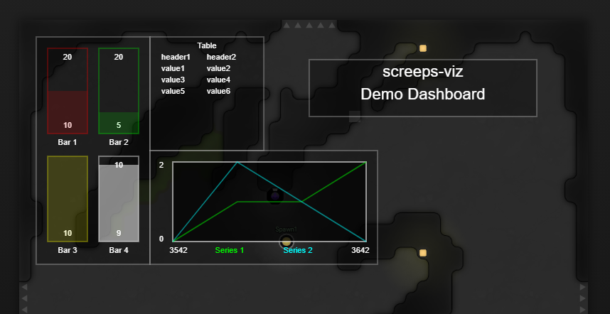

# screeps-viz



A visualization library for [Screeps](https://screeps.com/)

## Installation

Install via npm:

```
npm install screeps-viz
```

## Usage

This library is designed around functional programming principles. Until we have better documentation, please consult the source for each widget for its expected parameters, and see `src/demo.ts` for examples.

### Widgets

Most of the widgets will use a pattern like this, passing in a function that will be invoked each tick to get the current data and a config object.

```
const dataGenerator = () => {
    return {
        value: Game.time % 20
        maxValue: 20
    }
}
const config = {
    label: 'Bar 1',
    style: {
        stroke: 'red',
        fill: 'red',
        lineStyle: 'dashed'
    }
}

const widget = Bar(dataGenerator, config)
```

### Dashboard

The Dashboard itself takes a list of Widgets with position & size information, and returns a function you can call each tick to render the dashboard. If you pass a parameters object to the render function, it will passed in turn to the data methods of all the dashboard's widgets.

```
const renderDashboard = Dashboard({ 
    widgets: [{
        x: 1,
        y: 1,
        width: 5,
        height: 10,
        widget: barWidget
    }]
})

export function loop() {
    renderDashboard();
}
```